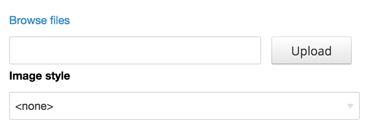
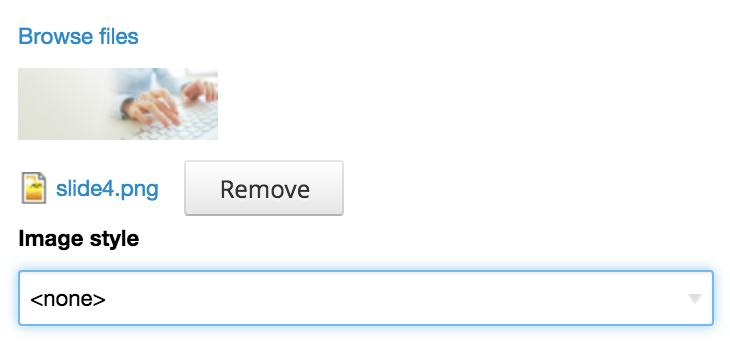

# Managed File

Extends default `managed_file` widget, which is a part of Form API, by a set of useful features. See examples below to be involved.

## Usage

These additional options for element with `'#type' => 'managed_file'` is come with this module:

Add the `Browse files` link before the file input to use one of available file managers:

```php
// Also could be "ckfinder".
'#widget' => 'imce',
```

Tired to add an image styles for every managed file field?

```php
// Add an additional "select" element with image styles.
'#styles' => TRUE,
```

Want a preview of the uploaded file?

```php
// Append a preview of the uploaded file.
'#preview' => TRUE,
```

Also, you need to know that this module implements an API of the [File MD5](https://drupal.org/project/file_md5) module.

### Complete example

```php
$form['image'] = [
  '#type' => 'managed_file',
  '#title' => t('Image'),
  // Also could be "ckfinder".
  '#widget' => 'imce',
  // Add an additional "select" element with image styles. When this is TRUE,
  // then return value will be an array with two properties: "fid" and "style"
  // instead of usual file ID as a string.
  '#styles' => TRUE,
  // Append a preview of the uploaded file.
  '#preview' => TRUE,
];
```

### Screenshots

Default state - empty file widget:



File is uploaded:


